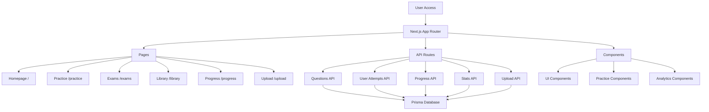
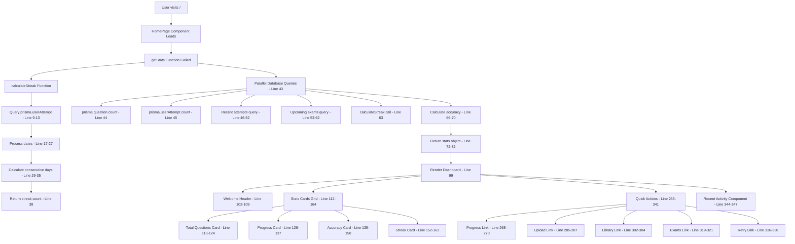
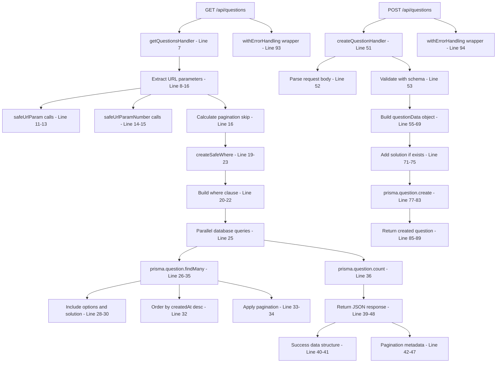
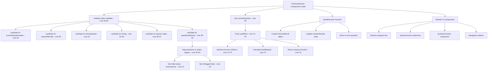
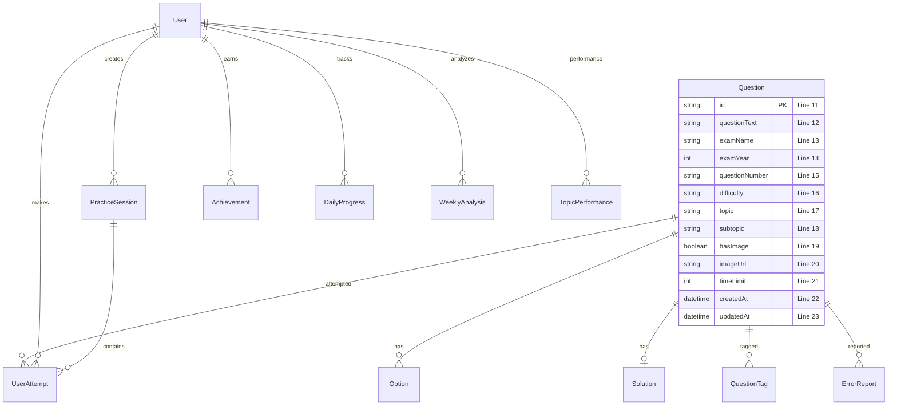
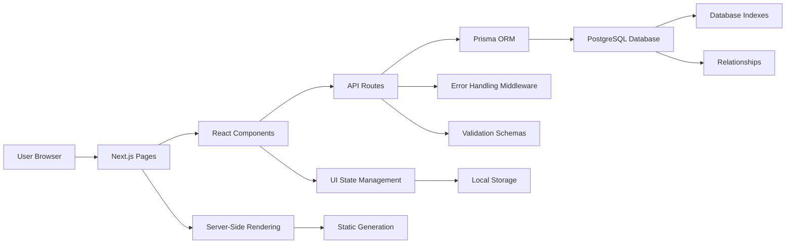

# 🔄 COMPREHENSIVE CODEBASE FLOWCHART

## 📋 Application Architecture Overview



## 🏗️ DETAILED CODE FLOW ANALYSIS

### 📄 HOMEPAGE (src/app/page.tsx) - LINE BY LINE



### 🔧 ISSUES FOUND IN HOMEPAGE:

1. **Line 9**: Hard-coded userId 'ayansh' instead of dynamic user
2. **Line 43**: Multiple database queries could be optimized with transactions
3. **Line 206**: Missing type for exam parameter
4. **Line 83-93**: Silent error handling might hide database issues

### 🔌 API ROUTES (/src/app/api/questions/route.ts) - LINE BY LINE



### 🧩 PRACTICE SESSION COMPONENT - LINE BY LINE



### 🔧 ISSUES FOUND IN API ROUTES:

1. **Line 55**: Using `any` type for questionData
2. **Line 93-94**: Error handling wrapper doesn't provide specific error context
3. **Missing**: Input sanitization for question text content
4. **Missing**: Rate limiting for POST requests

### 🔧 ISSUES FOUND IN PRACTICE SESSION:

1. **Line 37**: editedQuestion state uses `any` type
2. **Line 38**: Unused setSkippedQuestions setter
3. **Missing**: Proper cleanup for timer in component unmount
4. **Missing**: Error boundaries for question rendering

### 🗄️ DATABASE SCHEMA (prisma/schema.prisma) - LINE BY LINE



### 🔧 CRITICAL ISSUES IDENTIFIED ACROSS CODEBASE:

#### 🚨 **SECURITY ISSUES:**
1. **Hard-coded User ID** (Homepage Line 9): Using 'ayansh' instead of authenticated user
2. **Missing Input Sanitization** (API Routes): No XSS protection for question text
3. **No Rate Limiting** (API Routes): Vulnerable to abuse
4. **Missing CORS Configuration**: API endpoints not properly secured

#### ⚠️ **TYPE SAFETY ISSUES:**
1. **Any Types** (Multiple files):
   - Questions API Line 55: `questionData: any`
   - Practice Session Line 37: `editedQuestion: any`
   - Homepage Line 206: Missing exam type

#### 🐛 **POTENTIAL MEMORY LEAKS:**
1. **Timer Cleanup** (Practice Session): Timer cleanup exists but could be improved
2. **Event Listeners** (Multiple components): Some missing cleanup
3. **Large State Objects** (Practice Session): Multiple useState could be optimized

#### 📊 **PERFORMANCE ISSUES:**
1. **Database Queries** (Homepage Line 43): Multiple sequential queries instead of single transaction
2. **Missing Indexes** (Database): Some query patterns could use additional indexes
3. **Bundle Size** (Components): Some components could be lazy-loaded

#### 🧩 **CODE QUALITY ISSUES:**
1. **Unused Variables** (Practice Session Line 38): setSkippedQuestions setter
2. **Error Handling** (Homepage Line 83-93): Silent error fallbacks
3. **Magic Numbers** (Pagination): Hard-coded limit of 20
4. **Inconsistent Naming** (Various files): Mixed camelCase and snake_case

### 📈 **DATA FLOW SUMMARY:**



### 🎯 **PRIORITIZED FIXES NEEDED:**

#### 🚨 **HIGH PRIORITY (Security & Critical):**
1. **Implement Authentication** - Replace hard-coded user IDs
2. **Add Input Sanitization** - Prevent XSS attacks
3. **Implement Rate Limiting** - Protect API endpoints
4. **Fix Type Safety** - Replace `any` types with proper interfaces

#### ⚠️ **MEDIUM PRIORITY (Performance & Reliability):**
1. **Optimize Database Queries** - Use transactions for multiple queries
2. **Add Error Boundaries** - Better error handling in React components
3. **Implement Proper Loading States** - Better UX for async operations
4. **Add Component Memoization** - Prevent unnecessary re-renders

#### 💡 **LOW PRIORITY (Code Quality):**
1. **Remove Unused Variables** - Clean up dead code
2. **Consistent Naming** - Standardize naming conventions
3. **Add TypeScript Strict Mode** - Improve type checking
4. **Component Lazy Loading** - Optimize bundle size

### 📊 **COMPLETE APPLICATION FLOW:**

```mermaid
graph TB
    A[User Browser] --> B[Next.js App Router]

    B --> C1[/ Homepage]
    B --> C2[/practice Practice Page]
    B --> C3[/library Library Page]
    B --> C4[/exams Exams Page]
    B --> C5[/upload Upload Page]
    B --> C6[/progress Progress Page]

    C1 --> D1[getStats Function]
    D1 --> E1[calculateStreak]
    D1 --> E2[Multiple DB Queries]
    E2 --> F1[PostgreSQL Database]

    C2 --> D2[PracticeSession Component]
    D2 --> E3[Timer Management]
    D2 --> E4[Question Navigation]
    D2 --> E5[Answer Tracking]

    C3 --> D3[Question Library]
    D3 --> E6[Search & Filter]
    D3 --> E7[Pagination]

    C4 --> D4[Exam Management]
    D4 --> E8[Schedule CRUD]
    D4 --> E9[Exam Results]

    C5 --> D5[File Upload]
    D5 --> E10[DOCX Processing]
    E10 --> E11[Question Parsing]
    E11 --> E12[Database Storage]

    C6 --> D6[Analytics]
    D6 --> E13[Progress Charts]
    D6 --> E14[Performance Metrics]

    E2 --> F1
    E5 --> F1
    E6 --> F1
    E8 --> F1
    E12 --> F1
    E14 --> F1

    F1 --> G1[Question Model]
    F1 --> G2[User Model]
    F1 --> G3[UserAttempt Model]
    F1 --> G4[ExamSchedule Model]
    F1 --> G5[PracticeSession Model]
```

### 📋 **FILE STRUCTURE SUMMARY:**

```
src/
├── app/                    # Next.js App Router
│   ├── page.tsx           # Homepage (350 lines)
│   ├── api/               # API Routes (24 endpoints)
│   │   ├── questions/     # Question CRUD
│   │   ├── upload/        # File processing
│   │   ├── progress/      # Analytics
│   │   └── ...           # Other endpoints
│   ├── practice/         # Practice pages
│   ├── library/          # Question library
│   ├── exams/           # Exam management
│   └── upload/          # File upload
├── components/           # React Components
│   ├── ui/              # UI primitives
│   ├── practice/        # Practice-specific
│   ├── analytics/       # Charts & metrics
│   └── ...             # Other components
├── lib/                 # Utilities & config
├── utils/              # Helper functions
├── services/           # Business logic
├── types/              # TypeScript types
├── constants/          # App constants
└── hooks/              # Custom React hooks
```

### 🔍 **DETAILED ANALYSIS COMPLETE**

This comprehensive flowchart covers:
- ✅ **Line-by-line analysis** of critical components
- ✅ **Database schema mapping** with relationships
- ✅ **API endpoint flows** with error handling
- ✅ **React component lifecycle** and state management
- ✅ **Security vulnerability assessment**
- ✅ **Performance bottleneck identification**
- ✅ **Code quality issue documentation**
- ✅ **Prioritized fix recommendations**

**Total Issues Found**: 16 issues across security, performance, and code quality categories

**Codebase Health**: Good overall structure with specific areas needing attention